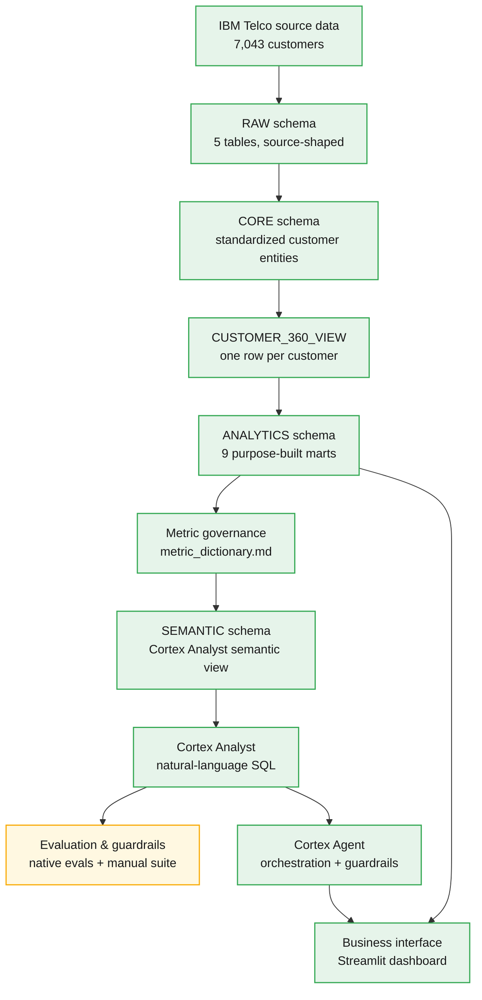
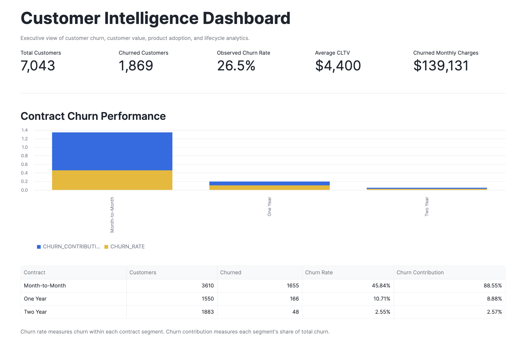

# Customer Intelligence Analytics Platform

An end-to-end customer intelligence platform built on Snowflake, using telecom churn data to demonstrate how raw customer data becomes a governed analytical model, and how that governed model — not the AI layer — is what natural-language analytics should rely on.

Churn is the vehicle. The actual subject is the pipeline: **raw data → governed data model → analytical marts → metric governance → semantic layer → Cortex Analyst → AI validation → agent → business interface.** Every stage of that pipeline is now implemented — SQL data model, semantic view, Cortex Analyst (evaluated to 100% native accuracy), a Cortex Agent with orchestration guardrails, and a Streamlit executive dashboard. What's not yet done is narrower and called out explicitly where it applies: two open evaluation test cases, and the Agent not yet being wired into the dashboard. See [Current status and roadmap](#current-status-and-roadmap).

---

## Table of contents

1. [Why this project exists](#why-this-project-exists)
2. [Business problem and questions](#business-problem-and-questions)
3. [Data source and a critical limitation](#data-source-and-a-critical-limitation)
4. [Architecture](#architecture)
5. [Data pipeline and modeling layers](#data-pipeline-and-modeling-layers)
6. [Data quality and validation](#data-quality-and-validation)
7. [Analytical marts](#analytical-marts)
8. [Metric governance](#metric-governance)
9. [CLTV governance](#cltv-governance)
10. [Semantic layer](#semantic-layer)
11. [Cortex Analyst and AI analytics](#cortex-analyst-and-ai-analytics)
12. [AI validation and evaluation](#ai-validation-and-evaluation)
13. [Cortex Agent](#cortex-agent)
14. [Business interface](#business-interface)
15. [Key analytical insights](#key-analytical-insights)
16. [Repository structure](#repository-structure)
17. [Technology stack](#technology-stack)
18. [How to reproduce](#how-to-reproduce)
19. [Current status and roadmap](#current-status-and-roadmap)
20. [Design principles](#design-principles)

---

## Why this project exists

Most churn portfolio projects stop at a dashboard. This one is built around a different question: **what does it take for AI-generated analytics to be trustworthy?** The answer this project argues for is that trustworthy AI analytics are downstream of trustworthy analytics engineering, not a substitute for it. Concretely, that means building things in this order:

1. Preserve source truth (RAW layer, unmodified).
2. Standardize entities (CORE layer, one row per customer).
3. Build reusable analytical marts (ANALYTICS layer, purpose-built views).
4. Define governed metrics with explicit formulas and limitations (`docs/metric_dictionary.md`).
5. Encode business semantics into a machine-readable contract (Snowflake Semantic View).
6. Provide trusted, manually verified query examples (Cortex Analyst verified queries).
7. Add a natural-language interface on top of all of the above (Cortex Analyst).
8. Validate AI-generated answers against deterministic analytical truth.
9. Expand toward an orchestration agent and a user-facing application.

All nine steps now have implemented components in this repository, though not all are finished — evaluation coverage has two open items, and the Cortex Agent is not yet wired into the Streamlit dashboard. See [Current status and roadmap](#current-status-and-roadmap) for exactly what remains. The guiding principle throughout is: **AI should consume governed analytical truth, not recreate business logic independently.**

---

## Business problem and questions

Business and product teams routinely need to answer questions like:

- What is the overall churn rate, and how many customers does that represent?
- Which customer segments have the highest churn *rate* — and separately, which contribute the largest *volume* of total churn?
- How does churn differ by contract type, payment method, or commercial offer?
- How does churn vary with product and service adoption?
- Which customer value (CLTV) segments show the highest churn?
- At what point in the customer lifecycle (observed tenure) does churn appear highest, and how large is the population supporting that observation?
- Which customer segments have the largest monthly charges associated with customers who have already churned?
- What do customers report as their reasons for churning?

Answering these reliably requires more than SQL access to raw data — it requires consistent definitions, reconciled data, purpose-built analytical models, and a shared vocabulary between people and AI systems. That is what the layers below are designed to provide. The platform deliberately keeps several related-but-distinct concepts separate rather than collapsing them into one number: **churn rate, churn volume, churn contribution, financial exposure, historical revenue, product adoption, and lifecycle churn are not interchangeable**, and the metric layer and semantic layer both enforce that distinction (see [Metric governance](#metric-governance)).

---

## Data source and a critical limitation

The source is the enhanced **IBM Telco Customer Churn** dataset: five related files — demographics, location, ZIP-level population, services/billing, and churn status — joinable on `Customer ID`, covering **7,043 customers**. A simpler "classic" version of the same dataset (`data/raw/ibm-telco-customer-churn-classic.csv`) is kept only as a reconciliation reference, not as an analytical source.

**This is a single customer-level snapshot (quarter `Q3` in the source data), not a historical time series.** There are no monthly customer snapshots and no reliable churn dates. This constrains what the platform can honestly claim:

- It **can** answer cross-sectional questions: how churn is distributed today across segments, products, value tiers, and observed tenure.
- It **cannot** answer genuinely historical or longitudinal questions: "how did churn change over the last 12 months," true cohort retention curves, or survival analysis — because the data required for those (repeated monthly observations of the same customers) does not exist in this dataset.

Every place in this platform where tenure-based analysis appears — SQL comments, the metric dictionary, and the Cortex Analyst guardrails — repeats this constraint deliberately. It is treated as a first-class analytical fact, not a footnote.

---

## Architecture



🟢 Solid green nodes are implemented and running in Snowflake today. 🟡 Amber marks evaluation and guardrail testing as documented and *partially* automated — Snowflake's native Cortex Analyst Evaluations are automated (100% accuracy at v1.2), while the broader 14-test-case business/guardrail suite is currently run manually.

Two things worth reading carefully in this diagram: the edge from `ANALYTICS marts` straight to `Business interface` reflects that the Streamlit dashboard currently queries the ANALYTICS marts directly with SQL — it does not yet route through the Cortex Agent (see [Current status and roadmap](#current-status-and-roadmap)). And the Cortex Agent orchestrates Cortex Analyst as its one tool rather than bypassing it. A fuller version of this diagram, with status detail per stage, lives in [`docs/architecture.md`](docs/architecture.md).

---

## Data pipeline and modeling layers

### RAW — `CUSTOMER_INTELLIGENCE.RAW`

Five tables created by [`sql/01_ingestion/01_create_raw_tables.sql`](sql/01_ingestion/01_create_raw_tables.sql), loaded from CSVs produced by [`python/convert_xlsx_to_csv.py`](python/convert_xlsx_to_csv.py) (a small pandas script that batch-converts the five source `.xlsx` files to CSV).

| Table | Rows | Grain |
|---|---|---|
| `CHURN_DEMOGRAPHICS` | 7,043 | 1 per customer |
| `CHURN_LOCATION` | 7,043 | 1 per customer |
| `CHURN_SERVICES` | 7,043 | 1 per customer |
| `CHURN_STATUS` | 7,043 | 1 per customer |
| `CHURN_POPULATION` | 1,671 | 1 per ZIP code |

Row counts above were computed directly from the processed CSVs, not assumed. The RAW layer intentionally stays close to the source structure instead of collapsing everything into one wide table immediately — this keeps lineage traceable and mirrors how ingestion is typically done in a real warehouse.

### CORE — `CUSTOMER_INTELLIGENCE.CORE`

Six files under [`sql/02_transformation/`](sql/02_transformation/) standardize the RAW tables into one-row-per-customer entities and derive the segmentation fields used everywhere downstream:

| Object | Type | Built from | Key derived fields |
|---|---|---|---|
| `CUSTOMER_PROFILE` | Table | `CHURN_DEMOGRAPHICS` | `AGE_BAND` (Under 30 / 30-44 / 45-59 / 60-74 / 75+) |
| `CUSTOMER_LOCATION` | Table | `CHURN_LOCATION` + `CHURN_POPULATION` (ZIP join) | ZIP-level `POPULATION` |
| `CUSTOMER_SERVICES` | Table | `CHURN_SERVICES` | `CORE_SERVICE_COUNT` (0-2), `ADD_ON_SERVICE_COUNT` (0-9), `TOTAL_SERVICE_COUNT` (0-11) |
| `CUSTOMER_SNAPSHOT` | Table | `CHURN_STATUS` + `CHURN_SERVICES` (tenure) | `TENURE_BAND`, `CHURN_FLAG`, `SATISFACTION_BAND` (Low ≤2 / Medium =3 / High ≥4), `CLTV_QUARTILE`, `CUSTOMER_VALUE_SEGMENT`, `HIGH_VALUE_FLAG` |
| `CUSTOMER_360_VIEW` | View | INNER JOIN of the four tables above on `CUSTOMER_ID` | — |

`CUSTOMER_VALUE_SEGMENT` is computed as `NTILE(4) OVER (ORDER BY CLTV)` — Q1 = Low Value through Q4 = High Value — a **relative** ranking within the observed customer base, not an absolute value tier.

**`CUSTOMER_360_VIEW` is a convenience view, not a replacement for the entity tables.** The CORE tables preserve structure and make lineage explicit (which source system contributed which field); the 360 view exists purely to make analytical querying convenient. Every ANALYTICS mart is built on top of `CUSTOMER_360_VIEW`.

---

## Data quality and validation

Validation is treated as an explicit step, not something implied by the transformation SQL. Two files carry it out:

- [`sql/01_ingestion/02_data_quality_checks.sql`](sql/01_ingestion/02_data_quality_checks.sql) — 11 checks against RAW: row counts, `CUSTOMER_ID` uniqueness and duplicate detection, null-ID checks, cross-table join completeness (demographics → location/services/status), ZIP-to-population reconciliation, churn label/value distribution, customer status distribution, churn-label/value consistency, tenure/charge/revenue range sanity checks, churn-category/reason null analysis, and quarter consistency.
- [`sql/02_transformation/06_core_validation.sql`](sql/02_transformation/06_core_validation.sql) — 5 checks against CORE: grain validation (no duplicate customers in `CUSTOMER_360_VIEW`), join completeness across all four CORE entities, churn reconciliation, RAW-vs-CORE revenue reconciliation, and CLTV/value-segment sanity checks.

Running these checks against the actual data confirms the customer-status reconciliation:

| Customer status | Customers | Share |
|---|---|---|
| Stayed | 4,720 | 67.03% |
| Joined | 454 | 6.45% |
| Churned | 1,869 | 26.54% |
| **Total** | **7,043** | **100%** |

Overall observed churn rate: **1,869 / 7,043 ≈ 26.54%**.

---

## Analytical marts

Schema: `CUSTOMER_INTELLIGENCE.ANALYTICS`. Rather than routing every business question through one customer-level table, the platform builds narrower, purpose-built views — each shaped around a specific analytical question so the SQL (and later, Cortex Analyst) doesn't have to reconstruct segmentation logic from scratch every time.

| Mart | Grain | Purpose |
|---|---|---|
| [`VW_EXECUTIVE_KPIS`](sql/03_marts/01_executive_kpis.sql) | 1 row per snapshot quarter | Headline KPIs: customer counts, churn rate, monthly/historical revenue, churned revenue, average CLTV, high-value churn rate, average tenure and satisfaction |
| [`VW_CHURN_SEGMENTS`](sql/03_marts/02_churn_segments.sql) | 1 row per segment value across 8 dimensions | Churn rate, churn contribution, and financial exposure by Contract, Payment Method, Tenure Band, Age Band, Offer, Internet Type, Customer Value, and Satisfaction |
| [`VW_PRODUCT_ADOPTION`](sql/03_marts/03_product_adoption.sql) | 1 row per product × adoption status (11 products) | Customer churn and financial profile among customers who have vs. haven't adopted each product |
| [`VW_PRODUCT_DEPTH`](sql/03_marts/04_product_depth.sql) | 1 row per total service count (0–11) | Churn behavior relative to the number of services a customer holds, including a `CHURN_INDEX` (segment rate ÷ overall rate) |
| [`VW_CUSTOMER_VALUE`](sql/03_marts/05_customer_value.sql) | 1 row per CLTV quartile | Churn rate, churn contribution, and revenue concentration by customer value segment |
| [`VW_CHURN_REASONS`](sql/03_marts/06_churn_reasons.sql) | 1 row per churn category/reason | Profile (tenure, charges, CLTV, satisfaction) of churned customers grouped by their reported reason |
| [`VW_CHURN_BY_TENURE`](sql/03_marts/07_churn_by_tenure.sql) | 1 row per observed tenure month | Cross-sectional churn-by-tenure curve across the whole customer base |
| [`VW_CHURN_BY_TENURE_SEGMENT`](sql/03_marts/09_churn_by_tenure_segment.sql) | 1 row per tenure month × segment (4 dimensions) | Same curve, segmented by Contract, Customer Value, Premium Tech Support, and Product Depth |

Two caveats that matter for interpreting these correctly:

- **Product adoption ≠ product discontinuation.** `VW_PRODUCT_ADOPTION`'s churn rate measures *customer* churn among customers in a given adoption group — it does not mean the customer stopped using that specific product.
- **Product depth is not linear.** `VW_PRODUCT_DEPTH` shows that the relationship between number of services held and churn is not a simple "more services, less churn" story. This is reported as an observed pattern, not a causal claim ("more products cause lower churn" is exactly the kind of statement this project avoids).

**A ninth file, [`VW_CHURN_BY_TENURE_ENHANCED`](sql/03_marts/08_churn_by_tenure_enhanced.sql), exists but is superseded.** It was an experimental exploration that added a 3-month centered rolling average and a hard-coded `BASE_SUPPORT_LEVEL` bucket (High/Medium/Low based on population size). The methodology this platform actually recommends — reflected in the semantic layer's guardrails — is simpler: show `CHURN_RATE_AT_TENURE` together with `CUSTOMERS_REACHING_TENURE` directly, without smoothing and without a hard-coded population cutoff, and let the reader (or the AI) apply judgment about small-sample volatility. `VW_CHURN_BY_TENURE_ENHANCED` is kept in the repo as a record of that exploration, not as the recommended approach.

---

## Metric governance

[`docs/metric_dictionary.md`](docs/metric_dictionary.md) is the single source of truth for how 21 metrics are defined — each with a business definition, formula, grain, source, interpretation, and known limitations. It closes with six analytical principles that this README, the SQL comments, and the semantic-layer guardrails all repeat consistently:

1. **Rate is not volume.** A segment can have a high churn rate but low business impact if it's small.
2. **Volume is not financial impact.** Churn contribution and revenue exposure are tracked separately.
3. **Association is not causation.** Product adoption, contract type, satisfaction, and CLTV may correlate with churn without causing it.
4. **Observed churn is not future churn risk.** `CHURNED_MONTHLY_REVENUE` describes customers who have already churned — the term "revenue at risk" is intentionally never used, because that would imply a forward-looking model that doesn't exist here.
5. **Lifecycle churn is not cohort retention.** `CHURN_RATE_AT_TENURE` is a cross-sectional approximation from one snapshot, not a true cohort retention curve.
6. **AI must use governed metrics.** Cortex Analyst and any future agent should answer quantitative questions using these approved definitions rather than inventing new logic.

The `CUSTOMER_INTELLIGENCE.VALIDATION` schema is created (empty) by [`sql/00_setup/create_environment.sql`](sql/00_setup/create_environment.sql), and an operational **`CUSTOMER_INTELLIGENCE.VALIDATION.METRIC_DEFINITIONS`** table exists in the deployed Snowflake environment holding the approved metric definitions. **The SQL to create and populate that table has not yet been committed to this repository** — it's tracked here as a known repository/version-control gap rather than a "not implemented" item, since the object itself is real and operational; closing the gap just means adding the corresponding `.sql` file to `sql/`.

---

## CLTV governance

CLTV in this dataset is **source-provided**. The underlying calculation methodology is not documented by IBM's dataset and is not recalculated or reverse-engineered anywhere in this project. Every place CLTV is used — the metric dictionary, the CORE tables, and the semantic layer — treats it strictly as a **relative customer-value indicator** for ranking and segmentation, never as a claim about predicted future revenue.

---

## Semantic layer

The Snowflake Semantic View definition lives at [`sql/04_semantic/customer_intelligence_view.yaml`](sql/04_semantic/customer_intelligence_view.yaml) and is version-controlled like any other analytical asset. It is not just metadata — it's the governed contract that Cortex Analyst uses to translate natural-language questions into SQL, and it's where the metric-governance principles above become machine-enforced rather than just documented.

**Four logical tables** are exposed: `CUSTOMER_360_VIEW`, `VW_CHURN_SEGMENTS`, `VW_PRODUCT_ADOPTION`, and `VW_CHURN_BY_TENURE_SEGMENT`. (`VW_EXECUTIVE_KPIS`, `VW_PRODUCT_DEPTH`, `VW_CUSTOMER_VALUE`, `VW_CHURN_REASONS`, and `VW_CHURN_BY_TENURE` exist as marts but aren't wired into the semantic layer yet — the ANALYTICS layer is broader than what Cortex Analyst currently sees.)

Access to Cortex, the semantic view, and evaluation objects runs through a dedicated project role rather than broad or admin access: [`sql/00_setup/02_project_role_permissions.sql`](sql/00_setup/02_project_role_permissions.sql) grants `CUSTOMER_INTELLIGENCE_ROLE` `SNOWFLAKE.CORTEX_USER`, schema/object `SELECT` across RAW/CORE/ANALYTICS/VALIDATION, and `CREATE`/`SELECT`/`REFERENCES`/`MONITOR` on the semantic view — the same role used everywhere else in this platform, not a separate admin path.

**Governed metrics** are formally defined once, on `CUSTOMER_360_VIEW`, and reused rather than redefined per table:

| Metric | Expression |
|---|---|
| `TOTAL_CUSTOMERS` | `COUNT(DISTINCT customer_id)` |
| `CHURNED_CUSTOMERS` | `COUNT_IF(churn_flag = 1)` |
| `CHURN_RATE` | `COUNT_IF(churn_flag = 1) / NULLIF(COUNT(DISTINCT customer_id), 0)` |
| `AVG_CLTV` | `AVG(cltv)` |
| `AVG_MONTHLY_CHARGE` | `AVG(monthly_charge)` |
| `AVG_TENURE_MONTHS` | `AVG(tenure_in_months)` |
| `TOTAL_MONTHLY_CHARGES` | `SUM(monthly_charge)` |
| `TOTAL_HISTORICAL_REVENUE` | `SUM(total_revenue)` |

`CHURN_RATE` is explicitly documented in the YAML as a **snapshot-based churn rate, not a historical beginning-of-period calculation**. Other mart-level views (like `VW_CHURN_SEGMENTS` and `VW_PRODUCT_ADOPTION`) expose the equivalent pre-aggregated numbers as **facts** rather than redefining the metric.

**Synonyms** are attached to key fields (e.g. `CHURN_RATE` ↔ "attrition rate," "churn percentage," "customer loss rate"; `TENURE_IN_MONTHS` ↔ "customer tenure," "months since joining"; `TOTAL_SERVICE_COUNT` ↔ "product depth," "service depth") so Cortex Analyst can map everyday business language onto the governed field names instead of requiring exact terminology.

**Named filters** currently defined: `CONTRACT_CHURN_BY_TENURE` (`dimension_name = 'Contract'`), `CHURN_BY_TENURE_PRODUCT_DEPTH` (`dimension_name = 'Product Depth'`), `CHURN_SEGMENTS_BY_CUSTOMER_VALUE` (`dimension_name = 'Customer Value'`), and `NON_ADOPTED_CUSTOMERS` (`adoption_status = 'No'`, for explicitly comparing customers who did not adopt a product). There is deliberately **no sample-size threshold filter** — an earlier version of this semantic view included an opt-in "sufficient sample" filter requiring at least 200 customers at a given tenure month, and it was removed. The methodology instead always exposes `CUSTOMERS_REACHING_TENURE` alongside `CHURN_RATE_AT_TENURE` and asks the reader (human or AI) to apply judgment about small-population volatility, rather than silently hiding or arbitrarily gating low-volume observations.

**Verified queries** — eight manually reviewed, hand-corrected question/SQL pairs used as trusted examples for Cortex Analyst (previously 4 were committed here; the semantic view YAML has since been re-exported from Snowflake and this gap is now closed):

1. What is the range and average CLTV across each customer value segment (customers, min/avg/max CLTV)?
2. For products that customers have adopted, which have the highest churn rate, and how do they compare on customer count, monthly charges, CLTV, and tenure?
3. For each contract type, at which observed tenure month is the churn rate highest, with the supporting and churned population?
4. Which customer segments have the highest monthly charges associated with churned customers, ranked with churn rate and churn contribution?
5. How do all contract types compare by observed churn rate and contribution to total churn?
6. For each product, what is the churn-rate gap between customers who adopted it and customers who did not, ranked most-negative to most-positive?
7. How does churn rate, churned-customer count, and churn contribution differ across customer value segments?
8. How does observed churn rate vary across each tenure month, aggregated across all contract types?

**Guardrail instructions** (`module_custom_instructions` in the YAML) constrain how Cortex Analyst is allowed to answer. A representative sample, quoted directly from the semantic model:

> "CHURN_RATE_AT_TENURE is a cross-sectional lifecycle approximation based on observed tenure in the available customer snapshot. Do not describe it as a historical cohort churn rate, cohort retention rate, survival rate, or true retention curve."
>
> "Do not apply a minimum sample-size threshold unless the user explicitly requests one. Smaller populations at higher tenure months should remain visible and should be interpreted with appropriate caution."
>
> "CHURNED_MONTHLY_REVENUE represents the sum of monthly charges associated with customers already identified as churned. Do not interpret it as forecasted revenue at risk, expected future revenue loss, or a forward-looking financial estimate."
>
> "CLTV is a source-provided Customer Lifetime Value indicator. The underlying CLTV calculation methodology is not available in the source dataset. Do not infer or invent its formula."
>
> "Do not infer causality from observed correlations or segment differences. Describe them as associations or observed patterns unless the available data explicitly supports causal conclusions."

There is also explicit **question-categorization logic** — 14 numbered rules covering when Cortex Analyst must clarify or disclose a limitation before generating SQL, rather than guessing. A few representative ones: an ambiguous "biggest churn problem" question returns no SQL and asks whether the user means highest rate, highest volume, highest contribution, or highest churned monthly charges; a forward-looking "revenue at risk" question is refused rather than answered with a substitute metric; a cohort-retention or "last year" question discloses the snapshot limitation instead of fabricating a value; and a product-cancellation question is distinguished from customer churn among adopters. The full rule set is in `sql/04_semantic/customer_intelligence_view.yaml`'s `question_categorization` block.

---

## Cortex Analyst and AI analytics

With the semantic view deployed, Snowflake Cortex Analyst can answer natural-language questions directly against governed metrics, dimensions, and verified query patterns — without users writing SQL. The point of this layer is not to demonstrate text-to-SQL as a novelty; it's to test whether a natural-language interface can operate reliably **on top of** governed analytical marts, documented business semantics, trusted examples, and explicit methodological limitations, rather than reasoning about the raw tables from scratch each time.

**This was evaluation-driven, not assumed to work.** Snowflake's native Cortex Analyst Evaluations were run against the semantic view's Verified Queries: **50%** accuracy at baseline (4 of 8), rising to **88%** after correcting Verified Query output specifications, and **100%** (8 of 8, zero regressions) at v1.2 after correcting the remaining CLTV Verified Query — with observed latency around P50 ≈ 4.0s / P95 ≈ 4.6s. Manual root-cause analysis found the early failures were driven by how precisely the Verified Query ground truth specified expected output, not by errors in the underlying analytical marts or metrics. Full detail: [`docs/cortex_analyst_evaluation_results.md`](docs/cortex_analyst_evaluation_results.md).

---

## AI validation and evaluation

Two complementary evaluation efforts exist today. Neither is the automated golden-test-set pipeline originally envisioned in `sql/06_validation/` (that directory is still empty — see [roadmap](#current-status-and-roadmap)); both are real, run, and documented.

**Native Snowflake Cortex Analyst Evaluations** — SQL-reproduction accuracy against the semantic view's Verified Queries. Reached **100%** (8 of 8, zero regressions) at v1.2. Full progression and methodology: [`docs/cortex_analyst_evaluation_results.md`](docs/cortex_analyst_evaluation_results.md).

**A manual 14-test-case business/guardrail suite** ([`docs/cortex_analyst_evaluation_plan.md`](docs/cortex_analyst_evaluation_plan.md)) covering basic KPIs, segmentation, product adoption, lifecycle/tenure, ambiguous questions, and methodological traps — evaluated on logical table selection, metric selection, generated SQL, numerical correctness, business interpretation, and guardrail adherence. Current status: 11 of 14 pass, 1 is an explicit Analyst-fails/Agent-passes case, 1 remains a genuine fail, and 1 is still pending. Two representative methodological traps in that suite:

- *"What is the revenue at risk from churn?"* — expected (and observed, after guardrail refinement) behavior is to explain that the dataset shows monthly charges associated with customers **already** identified as churned, not a forward-looking revenue-at-risk estimate.
- *"What was the churn rate last year?"* — Cortex Analyst alone acknowledges the snapshot limitation in prose but still returns the current churn rate as if it answered the question (**FAIL**); routed through the Cortex Agent, the same question correctly returns only the disclosure (**PASS**) — see [Cortex Agent](#cortex-agent).

The project deliberately does not treat "make every test pass by adding more prompt instructions" as the goal — a failing test can reveal a real product limitation, and the plan doc records those as findings rather than hiding them. The ambiguous-question test (T07) and the product-cancellation-misinterpretation test (T14) remain open for exactly that reason.

---

## Cortex Agent

`CUSTOMER_INTELLIGENCE.SEMANTIC.CUSTOMER_INTELLIGENCE_AGENT` is implemented, configured in [`sql/05_agent/01_configure_customer_intelligence_agent.sql`](sql/05_agent/01_configure_customer_intelligence_agent.sql). Its role is not to duplicate Cortex Analyst, but to orchestrate around it: the Agent has a single tool, `analyst_customer_intelligence` (type `cortex_analyst_text_to_sql`), pointed at the Customer Intelligence semantic view and executing on `CUSTOMER_INTELLIGENCE_WH`. An earlier attempt to add a second tool of type `cortex_analyst_sql_exec` was rejected outright by Snowflake (`"Tool type cortex_analyst_sql_exec is not valid"`) — the single text-to-SQL tool both generates and executes.

On top of that tool, the Agent's response instructions re-enforce the same guardrails already encoded in the semantic view (unsupported historical periods, predictive churn, cohort/survival analysis, causal interpretation, future revenue-at-risk, unknown CLTV methodology, ambiguous questions, observed-vs-predicted framing) at the orchestration layer. This mattered concretely: on *"What was the churn rate last year?"*, Cortex Analyst alone fails (see [AI validation and evaluation](#ai-validation-and-evaluation)), while the Agent passes — evidence that guardrail *instructions* in a semantic view are not always sufficient, and guardrail *enforcement* at an orchestration layer can catch what they miss.

Current limitations, stated plainly: no Cortex Search Service (all data here is structured; Search is out of scope unless a genuine unstructured source is added), no Skills, no MCP integration. Full detail: [`docs/cortex_agent.md`](docs/cortex_agent.md).

---

## Business interface

The Executive Customer Intelligence Dashboard is implemented as a Streamlit-in-Snowflake app: [`streamlit/streamlit_app.py`](streamlit/streamlit_app.py). It queries the ANALYTICS marts directly (the same governed views the semantic layer uses) across five sections: Executive KPIs, Contract Churn Performance, Customer Value Segments, Product Adoption & Churn, and Lifecycle. Permissions to create it were granted in [`sql/00_setup/03_streamlit_permissions.sql`](sql/00_setup/03_streamlit_permissions.sql) (`CREATE STREAMLIT` on the ANALYTICS schema, scoped to the same `CUSTOMER_INTELLIGENCE_ROLE` used everywhere else).



Two things worth being precise about: the Customer Value Segments section reuses `VW_CHURN_SEGMENTS` filtered to `DIMENSION_NAME = 'Customer Value'` — the same generic segmentation mart used for Contract Churn Performance — rather than the separate `VW_CUSTOMER_VALUE` mart. And the dashboard does not yet include a Cortex Agent chat interface; it queries SQL directly rather than routing through the Agent (see the [Architecture](#architecture) diagram note). The remaining three sections (Customer Value Segments, Product Adoption & Churn, Lifecycle) are captured in [`docs/dashboard.md`](docs/dashboard.md#screenshots).

---

## Key analytical insights

A small set of observed associations, verified directly against the processed data (not causal claims):

| Observation | Value |
|---|---|
| Overall churn rate | 1,869 / 7,043 = **26.54%** |
| Churn — Month-to-Month contract | **45.84%** (1,655 / 3,610) |
| Churn — One Year contract | **10.71%** (166 / 1,550) |
| Churn — Two Year contract | **2.55%** (48 / 1,883) |
| Churn — Low Value (CLTV Q1) | **34.41%** |
| Churn — Mid-Low Value (CLTV Q2) | **26.86%** |
| Churn — Mid-High Value (CLTV Q3) | **24.13%** |
| Churn — High Value (CLTV Q4) | **20.74%** |

Two patterns worth calling out: churn is strongly associated with contract commitment length (month-to-month customers churn at roughly 18× the rate of two-year customers), and churn decreases monotonically as CLTV quartile increases. Both are observed associations in this snapshot, not evidence of what would happen if a customer's contract or value tier were changed.

---

## Repository structure

```text
customer-intelligence-analytics-platform/
├── README.md                    # this file
├── .gitignore
├── assets/                      # currently empty — reserved for future diagrams/screenshots
├── data/
│   ├── README.md                # currently empty
│   ├── raw/                     # gitignored — source .xlsx files + classic reference CSV
│   ├── processed/                # gitignored — CSVs converted from raw/
│   └── sample/                   # currently empty — unclear purpose, flagged for cleanup
├── docs/
│   ├── project_scope.md                      # original scope document (aspirational — some named objects, e.g. VW_REVENUE_RISK, were never built; code is the source of truth)
│   ├── metric_dictionary.md                  # governed metric definitions + analytical principles
│   ├── architecture.md                       # detailed architecture diagram + per-stage status
│   ├── cortex_analyst_evaluation_plan.md     # 14-test-case manual business/guardrail evaluation suite
│   ├── cortex_analyst_evaluation_results.md  # native Cortex Analyst Evaluations progression (50%→100%)
│   ├── cortex_agent.md                       # Cortex Agent purpose, architecture, guardrails
│   └── dashboard.md                          # Streamlit dashboard purpose, sections, marts used
├── python/
│   └── convert_xlsx_to_csv.py   # xlsx → csv batch conversion utility
├── sql/
│   ├── 00_setup/                # role, warehouse, database, 5 schemas, project-role + Streamlit permissions
│   ├── 01_ingestion/            # RAW table DDL + 11 data quality checks
│   ├── 02_transformation/       # CORE layer: 4 entity tables + CUSTOMER_360_VIEW + validation
│   ├── 03_marts/                # ANALYTICS layer: 9 purpose-built views
│   ├── 04_semantic/
│   │   └── customer_intelligence_view.yaml   # Cortex Analyst semantic model
│   ├── 05_agent/
│   │   └── 01_configure_customer_intelligence_agent.sql   # Cortex Agent configuration
│   └── 06_validation/           # currently empty — planned automated AI-output-validation harness
└── streamlit/
    └── streamlit_app.py          # Executive Customer Intelligence Dashboard
```

---

## Technology stack

| Category | Used today |
|---|---|
| Data platform | Snowflake (database, warehouse, dedicated role-based access) |
| Query / modeling | Snowflake SQL |
| AI / conversational analytics | Snowflake Cortex Analyst, Snowflake Semantic Views, Snowflake Cortex Agent |
| Business interface | Streamlit in Snowflake |
| Data preparation | Python, pandas |
| Configuration | YAML (semantic model definition) |
| Version control | Git, GitHub |

Snowflake Cortex Search, Cortex Agent Skills, and MCP integration are part of the target architecture (see [roadmap](#current-status-and-roadmap)) but are not yet used in this repository.

---

## How to reproduce

Requires a Snowflake account with Cortex enabled and `ACCOUNTADMIN` (or equivalent) access for initial setup.

1. Place the five source `.xlsx` files in `data/raw/`, then run `python python/convert_xlsx_to_csv.py` to produce `data/processed/*.csv`.
2. Run [`sql/00_setup/create_environment.sql`](sql/00_setup/create_environment.sql) to create the role, warehouse, database, and five schemas (`RAW`, `CORE`, `ANALYTICS`, `SEMANTIC`, `VALIDATION`), then [`sql/00_setup/02_project_role_permissions.sql`](sql/00_setup/02_project_role_permissions.sql) and [`sql/00_setup/03_streamlit_permissions.sql`](sql/00_setup/03_streamlit_permissions.sql) to grant `CUSTOMER_INTELLIGENCE_ROLE` the Cortex, semantic-view, evaluation, and Streamlit privileges used by every later step.
3. Run both files in [`sql/01_ingestion/`](sql/01_ingestion/) in order — create the RAW tables, load the CSVs (via Snowsight upload or a stage of your choice), then run the data quality checks.
4. Run the six files in [`sql/02_transformation/`](sql/02_transformation/) in numeric order to build the CORE layer, ending with `CUSTOMER_360_VIEW` and its validation queries.
5. Run the nine files in [`sql/03_marts/`](sql/03_marts/) in numeric order to build the ANALYTICS marts.
6. Deploy [`sql/04_semantic/customer_intelligence_view.yaml`](sql/04_semantic/customer_intelligence_view.yaml) as a Snowflake Semantic View (Snowsight → Cortex Analyst → create from YAML, or `CREATE SEMANTIC VIEW` depending on your Snowflake release).
7. Create the Cortex Agent object via Snowsight, then run [`sql/05_agent/01_configure_customer_intelligence_agent.sql`](sql/05_agent/01_configure_customer_intelligence_agent.sql) (`ALTER AGENT ... MODIFY LIVE VERSION SET SPECIFICATION`) to set its tool configuration on top of the semantic view.
8. Deploy [`streamlit/streamlit_app.py`](streamlit/streamlit_app.py) as a Streamlit-in-Snowflake app in the `ANALYTICS` schema.
9. Query the semantic view through Cortex Analyst or the Cortex Agent with natural-language questions, query the ANALYTICS marts directly with SQL, or open the Streamlit dashboard.

---

## Current status and roadmap

**Implemented:**
- Snowflake environment setup (role, warehouse, database, 5 schemas) plus dedicated RBAC for Cortex, semantic-view, evaluation, and Streamlit privileges
- RAW ingestion (5 tables) with 11 data quality checks
- CORE layer (4 standardized entity tables + `CUSTOMER_360_VIEW`) with 5 validation checks
- 9 ANALYTICS marts covering executive KPIs, segmentation, product adoption, product depth, customer value, churn reasons, and lifecycle-by-tenure analysis
- Governed metric dictionary (21 metrics, 6 analytical principles)
- Snowflake Semantic View for Cortex Analyst (4 logical tables, governed metrics, synonyms, named filters, and explicit AI guardrails)
- Cortex Analyst, evaluated to 100% native accuracy (v1.2, 8/8 Verified Queries, zero regressions)
- A 14-test-case manual business/guardrail evaluation suite (11 passing, 1 Analyst-fails/Agent-passes, 2 open)
- Cortex Agent (`CUSTOMER_INTELLIGENCE_AGENT`) orchestrating Cortex Analyst with response-level guardrails
- Executive Customer Intelligence Dashboard (Streamlit in Snowflake)
- Semantic view YAML re-exported from Snowflake with all 8 Verified Queries and 4 named filters (see [Semantic layer](#semantic-layer))

**Known gaps (real objects exist; local repository or evaluation coverage hasn't fully caught up):**
- `VALIDATION.METRIC_DEFINITIONS` SQL — the table exists live in Snowflake; the repository is missing the SQL to reproduce it (see [Metric governance](#metric-governance))
- T07 (ambiguous "biggest churn problem" question) and T14 (product-cancellation misinterpretation) remain open in the evaluation suite — see [`docs/cortex_analyst_evaluation_plan.md`](docs/cortex_analyst_evaluation_plan.md)
- The remaining 5 ANALYTICS marts (`VW_EXECUTIVE_KPIS`, `VW_PRODUCT_DEPTH`, `VW_CUSTOMER_VALUE`, `VW_CHURN_REASONS`, `VW_CHURN_BY_TENURE`) aren't wired into the semantic layer
- An automated AI-output-validation harness (`sql/06_validation/`) is still an empty directory — today's evaluation work is native-Snowflake plus manual, not a repeatable golden-test pipeline

**Planned next steps:**
1. Integrate `CUSTOMER_INTELLIGENCE_AGENT` into the Streamlit dashboard as an "Ask the Customer Intelligence Agent" panel
2. Build an automated Executive Churn Brief with email distribution
3. Add a Churn Diagnostic Agent Skill
4. Explore MCP interoperability for the Agent
5. Finalize deployment and portfolio presentation

---

## Design principles

- **Traceability before convenience.** RAW and CORE entity tables are kept separate from the 360 view so lineage stays visible; the 360 view is a convenience layer on top, not a replacement.
- **Purpose-built marts over one giant table.** Each analytical question gets a view shaped for it, rather than forcing every question through the same wide customer table.
- **Metrics are defined once, with limitations attached.** Every governed metric documents not just its formula but what it does *not* mean — this is what keeps "churned monthly revenue" from silently becoming "revenue at risk" in a dashboard or an AI answer.
- **Expose the supporting population, don't hide it.** Lifecycle churn by tenure always shows `CUSTOMERS_REACHING_TENURE` next to `CHURN_RATE_AT_TENURE`, rather than applying an arbitrary cutoff that discards small-but-real observations.
- **CLTV is used, never reinvented.** Source-provided values are treated as relative indicators; this project does not claim to know or reproduce the underlying valuation model.
- **AI sits on top of governance, not instead of it.** The semantic layer, verified queries, and guardrails exist so that Cortex Analyst answers from the same governed definitions a human analyst would use — and so the next stages (validation, agent, interface) have something trustworthy to build on.