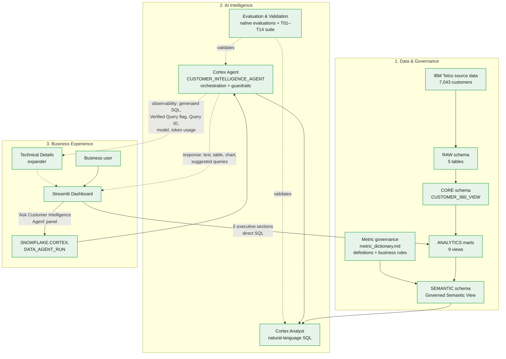

# Architecture

## End-to-end flow

This mirrors the three-layer model established in the [README](../README.md#architecture) — Data & Governance, AI Intelligence, Business Experience — with more implementation detail preserved in each layer.

**Legend:** 🟢 Implemented and running in Snowflake today.

## Reading the diagram

- **This mirrors the three-layer model in the README.** Data & Governance covers ingestion through the governed semantic contract; AI Intelligence covers Cortex Analyst, the Cortex Agent, and the QA capability that validates them; Business Experience covers the two Streamlit-driven paths business users actually take.
- **Metric Governance (`M`) feeds the Semantic View as a governance input, not a pipeline stage.** `M → F` runs alongside `D → F` (ANALYTICS marts feeding the Semantic View directly) — Metric Governance supplies business definitions and analytical rules; it does not transform or sit between any data objects.
- **Evaluation & Validation (`Q`) is a QA capability, not a downstream runtime stage.** It connects to Cortex Analyst and the Cortex Agent only via dotted `-.->|"validates"|` edges, and there is no edge running the other way — nothing in the diagram implies a query "passes through" evaluation at runtime. Native Cortex Analyst Evaluations are automated (100% accuracy at v1.2, see [`docs/cortex_analyst_evaluation_results.md`](cortex_analyst_evaluation_results.md)); the broader T01–T14 business/guardrail suite (see [`docs/cortex_analyst_evaluation_plan.md`](cortex_analyst_evaluation_plan.md)) is executed manually and documented. Manual execution doesn't make the capability itself incomplete, so both are represented as implemented. Separately, 4 end-to-end questions have been validated through the Agent via the deployed Streamlit app — see [`docs/cortex_agent.md`](cortex_agent.md#end-to-end-validation-streamlit--agent).
- **The Streamlit Dashboard has two independent, both-implemented paths into governed data.** Its five executive sections (`S → D`) query the ANALYTICS marts directly with SQL. Its "Ask Customer Intelligence Agent" panel (`S → R`) instead calls `SNOWFLAKE.CORTEX.DATA_AGENT_RUN`, which invokes the Cortex Agent (`R → H`). A predefined, known business question gets deterministic SQL; a new, ad hoc business question goes through the Agent and Cortex Analyst — that split is an intentional design decision, not an implementation limitation.
- **`H → G` (Cortex Agent → Cortex Analyst) reflects that the Agent orchestrates Cortex Analyst as its one tool**, `analyst_customer_intelligence` (type `cortex_analyst_text_to_sql`) — it does not bypass Cortex Analyst or talk to the semantic view directly. See [`docs/cortex_agent.md`](cortex_agent.md#architecture).
- **The two dashed edges out of the Agent are the response path, not a separate data source.** One carries the business-facing content (narrative text, dynamic table, dynamic chart, suggested follow-up questions) straight into the Streamlit panel; the other carries execution observability (generated SQL, Verified Query flag, Query ID, model name, token usage) into the collapsed "Technical Details" expander. Both come from the same `DATA_AGENT_RUN` JSON response — see [`docs/cortex_agent.md`](cortex_agent.md#streamlit-integration) and [`docs/dashboard.md`](dashboard.md#ask-customer-intelligence-agent).

## What each stage owns

| Stage | Owns | Status |
|---|---|---|
| Source files | Raw IBM Telco Customer Churn extracts | Implemented |
| RAW | Source-shaped ingestion, minimal transformation | Implemented |
| CORE | Standardized one-row-per-customer entities + `CUSTOMER_360_VIEW` | Implemented |
| ANALYTICS | 9 purpose-built marts (churn segments, product adoption, lifecycle, etc.) | Implemented |
| Metric governance | Business definitions and analytical rules that govern the Semantic View — a governance input, not a transformation stage in the data pipeline | Implemented (`docs/metric_dictionary.md`); operational `VALIDATION.METRIC_DEFINITIONS` table exists live in Snowflake, SQL to reproduce it is not yet committed |
| Semantic View | Machine-readable governed contract for natural-language access | Implemented (4 of 9 ANALYTICS marts currently wired in) |
| Cortex Analyst | Natural-language → SQL over the semantic view | Implemented, evaluated (100% native accuracy at v1.2) |
| Cortex Agent | Orchestration + guardrail enforcement on top of Cortex Analyst | Implemented (single tool, response guardrails) |
| `DATA_AGENT_RUN` invocation | SQL entry point Streamlit uses to call the Agent | Implemented (`run_customer_intelligence_agent()`) |
| Streamlit Dashboard | Executive/business-facing view over the ANALYTICS marts, plus the Agent-integrated "Ask Customer Intelligence Agent" panel | Implemented, fully Agent-integrated |
| Observability / traceability | Generated SQL, Verified Query flag, Query ID, model name, token usage surfaced per response | Implemented (Technical Details expander) |
| Evaluation & Validation | QA capability that validates Cortex Analyst and the Cortex Agent — native Cortex Analyst Evaluations are automated; the broader T01–T14 business/guardrail suite and 4 end-to-end Agent validations are executed manually and documented | Implemented |

This table intentionally does not include an automated AI-output-validation harness (a `sql/06_validation/` golden-test pipeline) — that remains planned, distinct from the evaluation work already done manually and via Snowflake's native evaluations.
