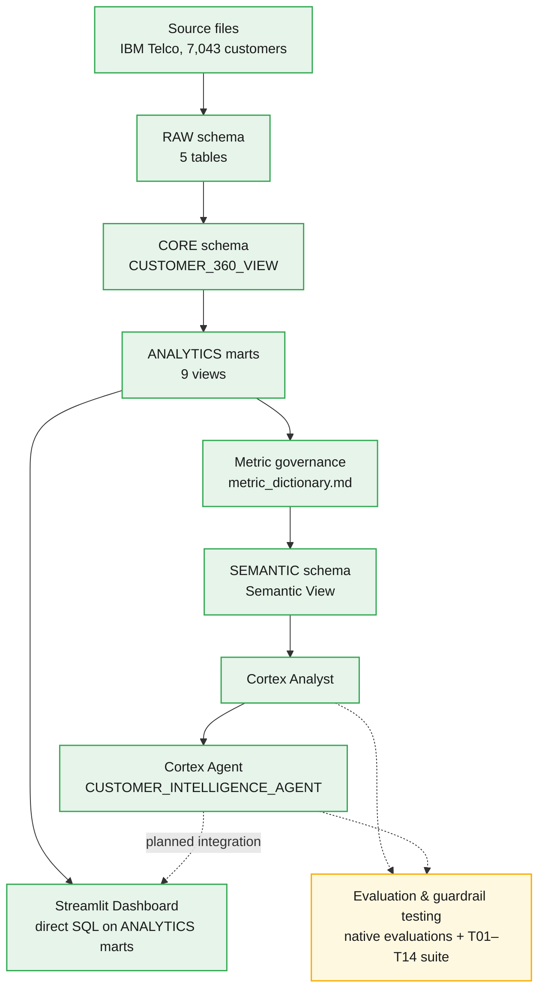

# Architecture

## End-to-end flow

**Legend:** 🟢 Implemented and running · 🟡 Documented and partially automated (native Snowflake evaluations are automated; the broader guardrail suite is currently run manually) · 🟡 dashed = planned but not yet wired.

## Reading the diagram

- **`H → I` (Cortex Agent → Streamlit Dashboard) is a dashed, planned edge.** The dashboard today queries the ANALYTICS marts directly with SQL (`D → I`), the same way Cortex Analyst does — it does not yet route through the Agent. Wiring the Agent into Streamlit as an "Ask the Customer Intelligence Agent" panel is the first roadmap item (see [README roadmap](../README.md#current-status-and-roadmap) and [`docs/dashboard.md`](dashboard.md#future-agent-integration-planned)).
- **`G → H` (Cortex Analyst → Cortex Agent) reflects that the Agent orchestrates Cortex Analyst as its one tool**, `analyst_customer_intelligence` (type `cortex_analyst_text_to_sql`) — it does not bypass Cortex Analyst or talk to the semantic view directly. See [`docs/cortex_agent.md`](cortex_agent.md#architecture).
- **Evaluation and guardrail testing sits alongside `Cortex Analyst` and `Cortex Agent`, not inline in the main pipeline.** It's a cross-cutting activity, not a stage data flows through: the native Cortex Analyst Evaluations (100% accuracy at v1.2, see [`docs/cortex_analyst_evaluation_results.md`](cortex_analyst_evaluation_results.md)) are automated, while the 14-test-case business/guardrail suite (see [`docs/cortex_analyst_evaluation_plan.md`](cortex_analyst_evaluation_plan.md)) is currently run manually — hence the intermediate ("documented and partially automated") styling rather than a plain implemented or planned state.

## What each stage owns

| Stage | Owns | Status |
|---|---|---|
| Source files | Raw IBM Telco Customer Churn extracts | Implemented |
| RAW | Source-shaped ingestion, minimal transformation | Implemented |
| CORE | Standardized one-row-per-customer entities + `CUSTOMER_360_VIEW` | Implemented |
| ANALYTICS | 9 purpose-built marts (churn segments, product adoption, lifecycle, etc.) | Implemented |
| Metric governance | Governed metric definitions and analytical principles | Implemented (`docs/metric_dictionary.md`); operational `VALIDATION.METRIC_DEFINITIONS` table exists live in Snowflake, SQL to reproduce it is not yet committed |
| Semantic View | Machine-readable governed contract for natural-language access | Implemented (4 of 9 ANALYTICS marts currently wired in) |
| Cortex Analyst | Natural-language → SQL over the semantic view | Implemented, evaluated (100% native accuracy at v1.2) |
| Cortex Agent | Orchestration + guardrail enforcement on top of Cortex Analyst | Implemented (single tool, response guardrails) |
| Streamlit Dashboard | Executive/business-facing view over the ANALYTICS marts | Implemented; not yet Agent-integrated |
| Evaluation & guardrail testing | Native accuracy evaluation + manual T01–T14 suite | Partially automated |

This table intentionally does not include an automated AI-output-validation harness (a `sql/06_validation/` golden-test pipeline) — that remains planned, distinct from the evaluation work already done manually and via Snowflake's native evaluations.
