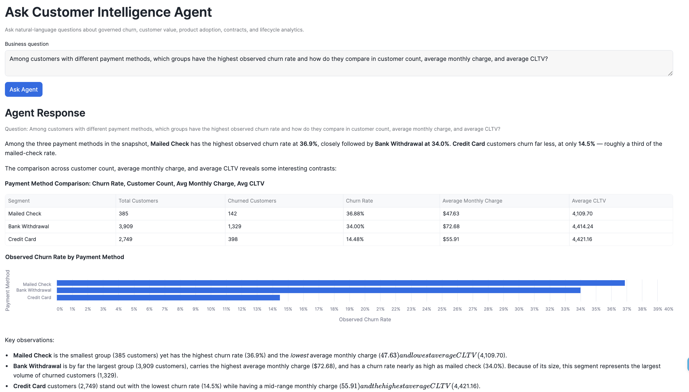
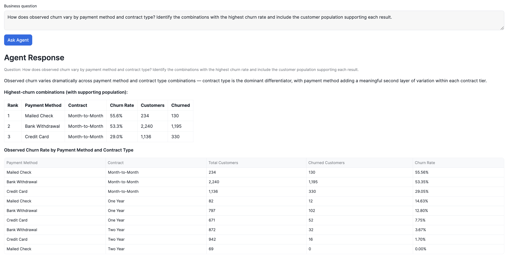
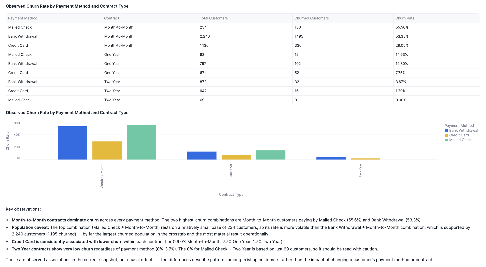
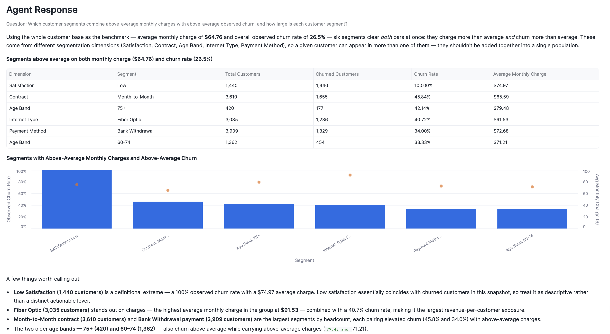

# Cortex Agent

## Purpose

`CUSTOMER_INTELLIGENCE.SEMANTIC.CUSTOMER_INTELLIGENCE_AGENT` is a Snowflake Cortex Agent that sits on top of Cortex Analyst. Its job is not to duplicate Cortex Analyst's text-to-SQL capability — it's to **orchestrate** around it: route business questions to the right tool, and enforce the platform's analytical guardrails at a layer that survives even when the underlying model's self-reported reasoning doesn't (see [Analyst vs. Agent](#analyst-vs-agent) below for a concrete case where this mattered).

Configuration is versioned in [`sql/05_agent/01_configure_customer_intelligence_agent.sql`](../sql/05_agent/01_configure_customer_intelligence_agent.sql). The agent object itself was created via Snowsight; its live specification was set with `ALTER AGENT ... MODIFY LIVE VERSION SET SPECIFICATION = $$ ... $$` — that is the exact command captured in the file, not `CREATE OR REPLACE AGENT ... FROM SPECIFICATION`. The executable block in that file contains **only** the `tools` and `tool_resources` configuration (tool type, tool name, semantic view, execution environment) — that is the part actually tested and validated live. The source of truth is the live object; this SQL is checked in to close the gap between that live object and the repository.

## Architecture

The Agent has exactly one tool:

| Tool name | Type | Points at |
|---|---|---|
| `analyst_customer_intelligence` | `cortex_analyst_text_to_sql` | `CUSTOMER_INTELLIGENCE.SEMANTIC.CUSTOMER_INTELLIGENCE_VIEW` |

The tool's `tool_resources` specify an `execution_environment` of type `warehouse`, pointed at `CUSTOMER_INTELLIGENCE_WH` — the same warehouse used throughout the rest of the platform, so query execution is billed and monitored consistently with everything else.

**A configuration note worth keeping:** an earlier attempt added a second tool of type `cortex_analyst_sql_exec` alongside the text-to-SQL tool. Snowflake rejected it outright with `"Tool type cortex_analyst_sql_exec is not valid."` The Agent uses only `cortex_analyst_text_to_sql` — that single tool both generates and executes the SQL.

## Streamlit integration

The Agent is called directly from the Streamlit executive dashboard, not just tested in isolation. `run_customer_intelligence_agent()` in [`streamlit/streamlit_app.py`](../streamlit/streamlit_app.py) issues:

```sql
SELECT SNOWFLAKE.CORTEX.DATA_AGENT_RUN(
    'CUSTOMER_INTELLIGENCE.SEMANTIC.CUSTOMER_INTELLIGENCE_AGENT',
    $$ {"messages": [{"role": "user", "content": [{"type": "text", "text": "<question>"}]}]} $$
) AS RESPONSE
```

and parses the returned JSON. The response's `content` array can interleave multiple item types — `text`, `table`, `chart`, `suggested_queries`, and `tool_result` — and the app deliberately renders them **in the order the Agent returned them** (`render_agent_response()`) rather than collapsing everything to a single "final answer" string, since a real answer often mixes narrative with a supporting table and chart.

Two observability sources are read out of the same response for the "Technical Details" panel (`render_agent_technical_details()`): the `tool_result` entry named `system_execute_sql` (generated SQL, whether a Verified Query was used, the Snowflake Query ID), and `metadata.usage.tokens_consumed` (model name, input/cache-read/cache-write/uncached-input/output token counts). [`sql/05_agent/02_test_agent_sql.sql`](../sql/05_agent/02_test_agent_sql.sql) contains the raw validation queries used to inspect this response structure before it was wired into Streamlit.

## Orchestration and response instructions

**These guardrails were configured through the Agent's "Instructions" UI in Snowsight, not typed into the SQL file.** The executable specification in `sql/05_agent/01_configure_customer_intelligence_agent.sql` contains only the `tools`/`tool_resources` block described above. What follows is a conceptual description of the instructions, written to match the platform's documented guardrails and the behavior observed live (see [The historical-period test](#the-historical-period-test) below) — it is not a verified verbatim transcript of the exact text entered in the Agent UI.

The Agent's instructions are split into three parts, matching Snowflake's agent specification shape:

- **`system`** — establishes the Agent's role and that it has no data source other than the `analyst_customer_intelligence` tool.
- **`orchestration`** — routes quantitative questions to that tool rather than answering from general knowledge, and instructs the Agent not to silently "fix" or reinterpret a tool result that looks inconsistent with the question.
- **`response`** — the guardrail layer, applied to every answer regardless of what the tool itself returns:

  1. **Unsupported historical periods** — the dataset is a single snapshot, not a time series; questions about specific past periods ("last year," "last quarter") should be disclosed as unanswerable, not silently answered with current-snapshot numbers.
  2. **Predictive churn** — no predictive model exists; observed metrics must not be presented as predicted probabilities.
  3. **Cohort / survival analysis** — tenure-based churn curves are cross-sectional approximations, never described as cohort retention or survival analysis, and always shown with their supporting population.
  4. **Causal interpretation** — segment/product churn differences are associations, never described as causal effects.
  5. **Future revenue-at-risk** — churn-associated revenue figures describe customers already churned, never a forecast.
  6. **Unknown CLTV methodology** — CLTV is source-provided; its formula is not known and must not be invented.
  7. **Ambiguous questions** — ambiguous terms like "biggest" churn problem should prompt a clarifying question rather than an assumed interpretation.
  8. **Observed vs. predicted** — every figure is framed as an observed outcome in the snapshot, not a forecast.

These mirror the guardrails already encoded in the semantic view's `module_custom_instructions` (see the [README's semantic layer section](../README.md#semantic-layer)) — the Agent layer restates them at the orchestration/response level rather than relying solely on the semantic model to enforce them.

## Analyst vs. Agent

| | Cortex Analyst alone | Customer Intelligence Agent |
|---|---|---|
| Tool access | Direct semantic-view querying | Wraps Cortex Analyst as a tool |
| Guardrails | Encoded in the semantic view's custom instructions | Re-enforced at the orchestration/response layer |
| Failure mode observed | Can acknowledge a limitation in prose while still returning a number that answers the question anyway | Designed to refuse/disclose rather than silently substitute |

### The historical-period test

**Question:** *"What was the churn rate last year?"*

- **Cortex Analyst alone: FAIL.** It recognized the snapshot limitation in its explanation, but still returned the current snapshot's churn rate as if it answered the historical question — see T10 in [`docs/cortex_analyst_evaluation_plan.md`](cortex_analyst_evaluation_plan.md).
- **Customer Intelligence Agent: PASS.** The Agent correctly responded that the dataset is a point-in-time snapshot and cannot provide a historical last-year churn rate, without substituting the current figure.

This is the concrete evidence for the value of the orchestration layer: guardrail *instructions* alone (in the semantic view) were not sufficient to prevent a silent substitution; guardrail *enforcement* at the Agent layer was.

## End-to-end validation (Streamlit + Agent)

**This is a third, separate validation effort from the two described in [`docs/cortex_analyst_evaluation_results.md`](cortex_analyst_evaluation_results.md) and [`docs/cortex_analyst_evaluation_plan.md`](cortex_analyst_evaluation_plan.md).** Those two measure Cortex Analyst on its own (native SQL-reproduction accuracy, and the manual T01–T14 guardrail suite, respectively). What follows was run through the actual deployed Streamlit app — question typed into the "Ask Customer Intelligence Agent" panel, `DATA_AGENT_RUN` invoking the Agent, response rendered end to end.

**1. Supported contract-churn question.** *"Compare all contract types by observed churn rate and contribution to total churn..."* returned the exact governed numbers as narrative + table + a dynamically generated chart:

| Contract | Customers | Churned | Churn Rate | Churn Contribution |
|---|---:|---:|---:|---:|
| Month-to-Month | 3,610 | 1,655 | 45.84% | 88.55% |
| One Year | 1,550 | 166 | 10.71% | 8.88% |
| Two Year | 1,883 | 48 | 2.55% | 2.57% |


**2. Product adoption question.** The Agent correctly compared customer churn among adopters vs. non-adopters of a product, did not interpret this as product cancellation, and presented the differences as descriptive associations rather than causal claims — consistent with the `VW_PRODUCT_ADOPTION` semantics documented in the [README](../README.md#analytical-marts).

**3. Ambiguous question.** *"What is our biggest churn problem?"* — the Agent did not arbitrarily pick a metric. It asked whether the user meant highest churn rate, highest churned-customer volume, highest churn contribution, or highest monthly charges associated with churned customers:


**4. Unsupported historical question.** *"What was our churn rate last year?"* — the Agent refused to fabricate a historical value, explained that the source is a point-in-time customer snapshot, and offered current observed snapshot churn analysis instead:


Together with [the historical-period test](#the-historical-period-test) above (which specifically contrasts Cortex-Analyst-alone behavior against the Agent), these four questions are the current end-to-end evidence that the Agent's guardrails hold up when driven from the real UI, not just when tested directly against the Agent API.

## Ad Hoc Analysis Beyond Verified Queries

**This validates a fourth, distinct claim from the three evaluation efforts already documented:**

- (A) Native Cortex Analyst Evaluations — 50% → 88% → 100% SQL-reproduction accuracy against the 8 Verified Queries ([`docs/cortex_analyst_evaluation_results.md`](cortex_analyst_evaluation_results.md)).
- (B) The manual Cortex-Analyst-alone guardrail suite — T01–T14 ([`docs/cortex_analyst_evaluation_plan.md`](cortex_analyst_evaluation_plan.md)).
- (C) The [4 end-to-end Streamlit + Agent validations](#end-to-end-validation-streamlit--agent) above — supported query, product adoption, ambiguity, historical refusal.
- **(D) Novel ad hoc analytical generalization beyond Verified Queries — this section.**

**The semantic layer is not a closed list of 8 supported questions.** Verified Queries are trusted, manually validated question/SQL examples — they improve reliability for important recurring questions, but they do not define the complete supported query space. For a new question, Cortex Analyst generates SQL dynamically from the governed Semantic View, using the same dimensions, facts, metrics, and guardrail instructions that back every other question. The three tests below were run through the deployed Streamlit app specifically to probe this: each one asked something no Verified Query covers, and in every case the Technical Details panel reported **Verified Query: No** — yet the Agent still returned governed, correctly-interpreted results.

### Test 1 — Payment method analysis

**Question:** *"Among customers with different payment methods, which groups have the highest observed churn rate and how do they compare in customer count, average monthly charge, and average CLTV?"*

**Tests:** whether Cortex Analyst can generate a new single-dimension breakdown (Payment Method) combining churn rate, population, monthly charge, and CLTV — a combination no Verified Query covers.

**Key results:**

| Payment method | Customers | Churned | Churn rate | Avg. monthly charge | Avg. CLTV |
|---|---:|---:|---:|---:|---:|
| Mailed Check | 385 | 142 | 36.88% | $47.63 | 4,109.70 |
| Bank Withdrawal | 3,909 | 1,329 | 34.00% | $72.68 | 4,414.24 |
| Credit Card | 2,749 | 398 | 14.48% | $55.91 | 4,421.16 |

**Why it matters:** the Agent correctly kept rate separate from volume (Mailed Check is the smallest group yet has the highest rate; Bank Withdrawal is the largest group and contributes the most churned customers in absolute terms), and described CLTV throughout as a source-provided relative indicator rather than implying a methodology for it.

**Verified Query:** No. Generated SQL used the governed `VW_CHURN_SEGMENTS` logical table, grouped by the Payment Method dimension.



### Test 2 — Payment method × contract (cross-dimensional)

**Question:** *"How does observed churn vary by payment method and contract type? Identify the combinations with the highest churn rate and include the customer population supporting each result."*

**Tests:** whether the Agent can construct a novel two-dimensional cross-tab (Payment Method × Contract) that doesn't correspond to any single existing mart's grain — this is the strongest evidence of generalization beyond Verified Queries, since it required combining two dimensions dynamically rather than filtering one.

**Key results (highest-churn combinations):**

| Payment method | Contract | Customers | Churned | Churn rate |
|---|---|---:|---:|---:|
| Mailed Check | Month-to-Month | 234 | 130 | 55.56% |
| Bank Withdrawal | Month-to-Month | 2,240 | 1,195 | 53.35% |
| Credit Card | Month-to-Month | 1,136 | 330 | 29.05% |

The full response covered all 9 payment-method × contract combinations, including One Year and Two Year tiers (down to 0.00%–14.63% churn).

**Why it matters:** the Agent explicitly flagged that the top combination (Mailed Check + Month-to-Month, 234 customers) rests on a smaller population than the second-highest (Bank Withdrawal + Month-to-Month, 2,240 customers) and is therefore more volatile — supporting population stayed visible rather than being dropped in favor of a clean ranking. It also closed by stating these are "observed associations in the current snapshot, not causal effects" — payment method and contract type are not interpreted as causing churn.

**Verified Query:** No. Generated SQL dynamically grouped `CUSTOMER_360_VIEW` by `payment_method` and `contract`, computing total customers, churned customers, and observed churn rate per combination.





### Test 3 — Above-average monthly charges + above-average churn (benchmark-derived segmentation)

**Question:** *"Which customer segments combine above-average monthly charges with above-average observed churn, and how large is each customer segment?"*

**Tests:** whether the Agent can derive its own analytical thresholds from the data (portfolio averages) and then use them as a dynamic filter — rather than answering against a fixed, predefined condition.

**Key results:** the Agent first established benchmarks — average monthly charge **$64.76**, overall observed churn rate **26.5%** — then identified six segments exceeding both, drawn from five different dimensions:

| Dimension | Segment | Customers | Churned | Churn rate | Avg. monthly charge |
|---|---|---:|---:|---:|---:|
| Satisfaction | Low | 1,440 | 1,440 | 100.00% | $74.97 |
| Contract | Month-to-Month | 3,610 | 1,655 | 45.84% | $65.59 |
| Age Band | 75+ | 420 | 177 | 42.14% | $79.48 |
| Internet Type | Fiber Optic | 3,035 | 1,236 | 40.72% | $91.53 |
| Payment Method | Bank Withdrawal | 3,909 | 1,329 | 34.00% | $72.68 |
| Age Band | 60-74 | 1,362 | 454 | 33.33% | $71.21 |

**Why it matters:** because these six segments come from five different segmentation dimensions, a given customer can appear in more than one of them — the Agent explicitly stated the populations overlap and "shouldn't be added together into a single population," avoiding the common mistake of summing cross-dimensional segment counts as if they were mutually exclusive.

**Verified Query:** No. Generated SQL used `VW_CHURN_SEGMENTS`, dynamically filtering on `avg_monthly_charge > ~64.76 AND churn_rate > ~26.54%` after computing the benchmarks.



## Current limitations

- **No Cortex Search Service.** All data here is structured (SQL tables/views); there is no unstructured document corpus, so Search is intentionally not part of this Agent. It will only be introduced if a genuine unstructured data source is added to the project.
- **No Skills.** The Agent has a single tool today; it does not yet compose multiple specialized skills.
- **No MCP integration.** Exposing this Agent (or its tools) over MCP is on the roadmap, not implemented.
- **No conversational memory in the Streamlit panel.** `st.session_state` holds only the single most recent question/response pair — each new question overwrites the last rather than accumulating a multi-turn conversation.
- **Guardrail testing against the Agent is broader than one case, but still not the full suite.** The historical-period comparison above plus the [4 end-to-end validations](#end-to-end-validation-streamlit--agent) (contract churn, product adoption, ambiguous question, unsupported historical question) have been explicitly run through the deployed Streamlit app; running the complete T01–T14 suite against the Agent is still future work (see [`docs/cortex_analyst_evaluation_plan.md`](cortex_analyst_evaluation_plan.md#future-cortex-agent-comparison)).
