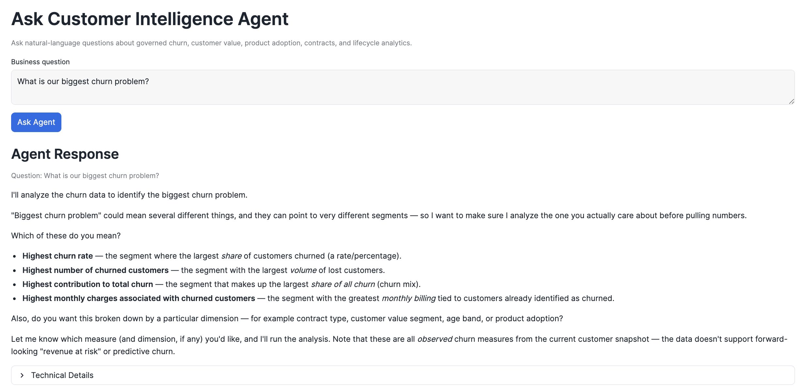
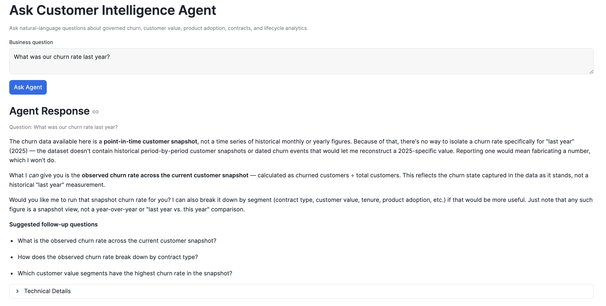
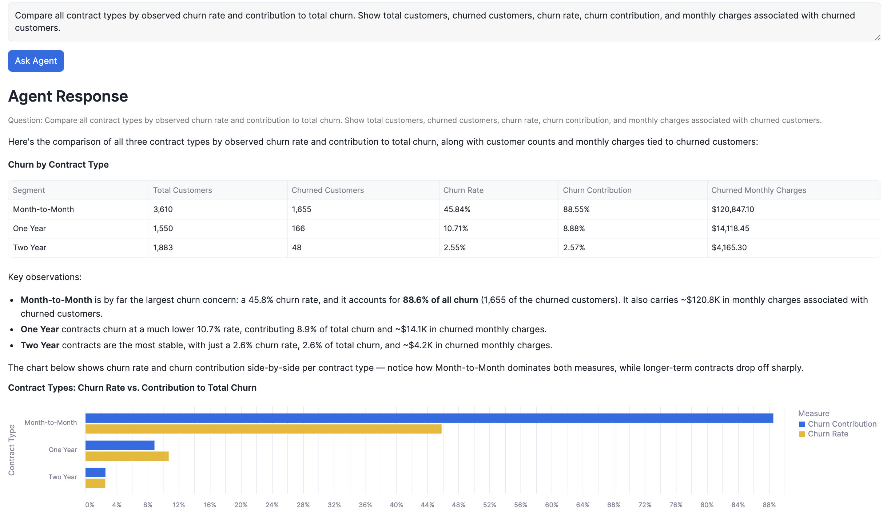
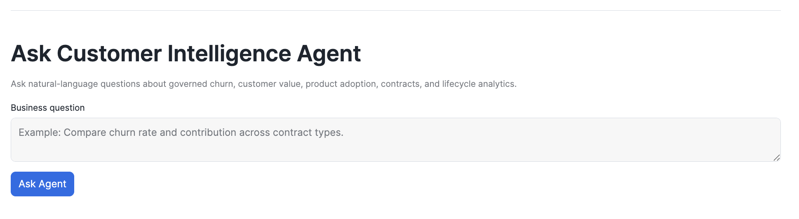
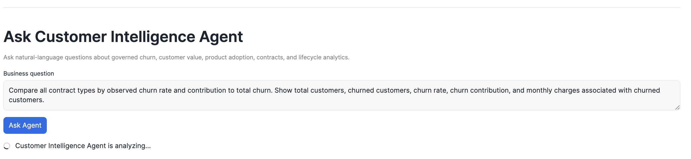
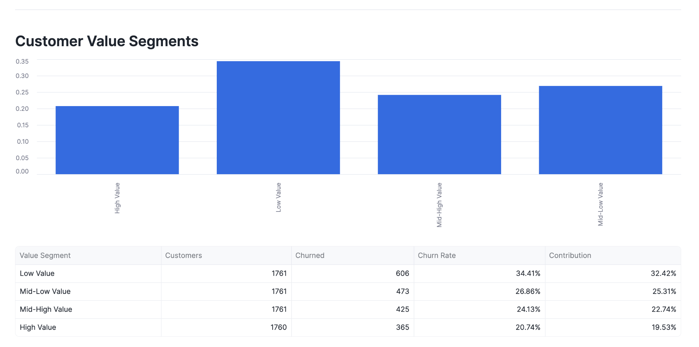
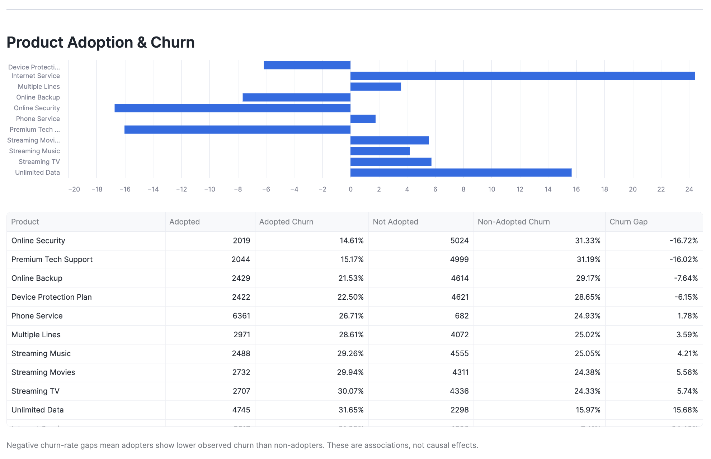
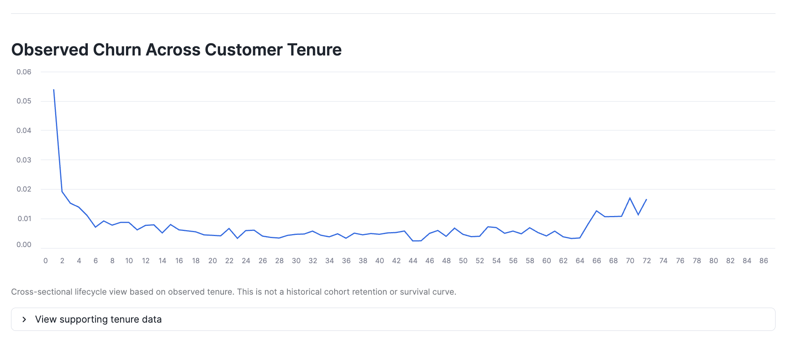

# Executive Customer Intelligence Dashboard

## Purpose

A Streamlit-in-Snowflake application that gives business stakeholders a governed, no-SQL view into customer churn, segmentation, product adoption, and lifecycle patterns — reading directly from the same ANALYTICS marts used by the semantic layer and Cortex Analyst, so the dashboard never disagrees with the AI layer on a number. It also includes a natural-language "Ask Customer Intelligence Agent" panel, so business users can ask ad-hoc questions without leaving the dashboard or writing SQL.

## Intended business users

Product Data Analysts, Product Managers, Retention/Commercial Analytics teams, and senior business stakeholders who need recurring performance monitoring without writing SQL — the same audience described in [`docs/project_scope.md`](project_scope.md).

## Implementation

App code: [`streamlit/streamlit_app.py`](../streamlit/streamlit_app.py). Permissions to create the app were granted via [`sql/00_setup/03_streamlit_permissions.sql`](../sql/00_setup/03_streamlit_permissions.sql) (database usage, ANALYTICS schema usage, `CREATE STREAMLIT` on the ANALYTICS schema).

## Sections

| Section | Analytical mart(s) / data source | What it shows |
|---|---|---|
| Executive KPIs | `VW_EXECUTIVE_KPIS` | Total customers, churned customers, observed churn rate, average CLTV, churned monthly charges |
| Contract Churn Performance | `VW_CHURN_SEGMENTS` filtered `DIMENSION_NAME = 'Contract'` | Customers, churned customers, churn rate, and churn contribution per contract type |
| Customer Value Segments | `VW_CHURN_SEGMENTS` filtered `DIMENSION_NAME = 'Customer Value'` | Churn rate, churn contribution, and average CLTV per CLTV-quartile value segment |
| Product Adoption & Churn | `VW_PRODUCT_ADOPTION` | Adopted vs. non-adopted customer churn rate per product, and the churn-rate gap between the two groups |
| Lifecycle | `VW_CHURN_BY_TENURE_SEGMENT` filtered `DIMENSION_NAME = 'Contract'` | Observed churn rate by tenure month, aggregated across contract types, shown together with the supporting customer population at each month |
| Ask Customer Intelligence Agent | `SNOWFLAKE.CORTEX.DATA_AGENT_RUN` → `CUSTOMER_INTELLIGENCE_AGENT` | Natural-language questions answered with narrative text, dynamic tables, dynamic Vega-Lite charts, suggested follow-up questions, and a Technical Details observability panel |

**Important correction for accuracy:** Customer Value Segments intentionally reuses `VW_CHURN_SEGMENTS` (the same generic segmentation mart used for Contract Churn Performance), filtered to `DIMENSION_NAME = 'Customer Value'` — it does **not** query the separate `VW_CUSTOMER_VALUE` mart, even though that mart exists in the ANALYTICS schema and covers similar ground. Keeping the dashboard on one generic mart for both sections keeps the segmentation logic and column names consistent across the app; `VW_CUSTOMER_VALUE`'s richer revenue-concentration fields are not currently surfaced here.

## Ask Customer Intelligence Agent

Unlike the five sections above, this panel does not run its own SQL against the ANALYTICS marts. `run_customer_intelligence_agent()` sends the user's question to `SNOWFLAKE.CORTEX.DATA_AGENT_RUN('CUSTOMER_INTELLIGENCE.SEMANTIC.CUSTOMER_INTELLIGENCE_AGENT', ...)` and parses the returned JSON — the Agent (via Cortex Analyst and the semantic view) is the one deciding what SQL to run.

**Rendering, in original response order.** `render_agent_response()` iterates the response's `content` array and dispatches each item by type, rather than only showing a single "final answer" string:

- `text` → rendered as narrative Markdown (`render_agent_response` inline).
- `table` → `render_agent_table()`: extracts the result set, renames technical columns to business-friendly labels (e.g. `CHURN_RATE` → "Churn Rate", `CHURNED_MONTHLY_REVENUE` → "Churned Monthly Charges"), formats churn-rate-family columns as percentages, customer/volume columns with thousands separators, and monetary columns as currency — and explicitly formats CLTV columns as a plain numeric indicator, **not** currency, since the source methodology is unknown.
- `chart` → `render_agent_chart()`: renders the Agent's Vega-Lite `chart_spec` via `st.vega_lite_chart`.
- `suggested_queries` → rendered as a bulleted list of follow-up questions the user can ask next.

**Technical Details (observability).** `render_agent_technical_details()` reads the response's `tool_result` (for the underlying `system_execute_sql` call) and `metadata.usage.tokens_consumed`, and displays them in a collapsed expander below the response: whether a Verified Query was used, the Snowflake Query ID, the model name, the generated SQL, and token usage broken out as input, cache read, cache write, uncached input, and output. This keeps the business-facing answer uncluttered while making the underlying execution fully inspectable on demand.

A response may come from a matched Verified Query or from SQL Cortex Analyst generated dynamically against the governed semantic view — the panel is not limited to the 8 predefined Verified Queries. Because the `Verified Query` flag is always shown, either path is auditable rather than a black box. See [`docs/cortex_agent.md`](cortex_agent.md#ad-hoc-analysis-beyond-verified-queries) for detailed evidence of the Agent answering novel questions with `Verified Query: No`.

**Screenshots** (question, response, and Technical Details together):

*"What is our biggest churn problem?"* — the Agent does not guess a metric; it asks whether the user means highest rate, highest volume, highest contribution, or highest churned monthly charges.

*"What was our churn rate last year?"* — the Agent explains the dataset is a point-in-time snapshot, declines to invent a historical figure, and offers the current observed rate plus follow-up suggestions instead.

A supported question returning the governed contract-churn numbers as narrative + table + a dynamically generated chart, in the order the Agent produced them.

The panel's idle state before a question is submitted.

The panel while `DATA_AGENT_RUN` is executing — `st.spinner("Customer Intelligence Agent is analyzing...")` covers the synchronous SQL call.

## Metric definitions

Every metric shown (`CHURN_RATE`, `CHURN_CONTRIBUTION`, `CHURNED_MONTHLY_REVENUE`, `AVG_CLTV`, `CUSTOMERS_REACHING_TENURE`, `CHURN_RATE_AT_TENURE`, etc.) follows the definitions in [`docs/metric_dictionary.md`](metric_dictionary.md). The dashboard does not recompute or redefine any metric — it queries the governed marts as-is.

## Methodology limitations (surfaced directly in the app)

- All figures come from a single observed customer snapshot, not a historical time series.
- The lifecycle section is a cross-sectional approximation, explicitly labeled as such in-app — not cohort retention, not a survival curve, not a longitudinal trend.
- Product Adoption & Churn gaps are observed associations between customer groups, not evidence that a product causes a churn difference.
- Customer value segments are relative CLTV quartiles; CLTV's underlying methodology is source-provided and unknown.
- "Churned Monthly Charges" is never described as revenue at risk — it describes customers already identified as churned.

## Screenshots

Captured from the deployed Streamlit-in-Snowflake app.

**Executive KPIs and Contract Churn Performance**

**Customer Value Segments**

**Product Adoption & Churn**

**Observed Churn Across Customer Tenure (Lifecycle)**

## Current limitations of the Agent panel

- **No conversational memory.** `st.session_state` holds only the single most recent question and response (`agent_question`, `agent_response`) — each new question overwrites the last one rather than accumulating a chat history.
- **No Skills, no MCP.** The Agent has exactly one tool (`analyst_customer_intelligence`); see [`docs/cortex_agent.md`](cortex_agent.md#current-limitations) for the full list.
- **Guardrail coverage via Streamlit is 4 questions, not the full suite.** The end-to-end validations documented in [`docs/cortex_agent.md`](cortex_agent.md#end-to-end-validation-streamlit--agent) cover the highest-value cases (supported churn question, product adoption, ambiguous question, unsupported historical question) — the broader T01–T14 Cortex-Analyst-alone suite has not yet been re-run through this panel.
